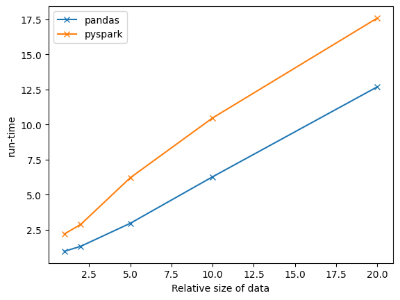

# CS-6220 Programming Assignment 1
## Mining the White House Visitor Log Dataset

### Prerequisites/Libraries used
1. `python3.9+`
1. `numpy`
1. `pandas`
1. `matplotlib`
1. `pyspark`

### Description of the Data
The data comes from the official White House website (https://www.whitehouse.gov). A 12-month time window between June 2022 to May 2023 was chosen. According to the visitor logs, there were 583170 people.

The main analysis results are shown in `whitehouse-pyspark.ipynb`.

### Code used
`pyspark` is an implementation of `spark` in Python. The code mainly uses the Dataframe/SQL API for finding the required statistics. However, for building histograms, the `RDD` api was used. `matplotlib` was used for building plots.

### Timing Experiments
Other hand , we also compare the runtime of the `pyspark` implementation with a `pandas` implementation. `whitehouse-pandas.ipynb` shows the `pandas` implementation. The scripts are included in `experiment-pyspark.py` and `experiment-pandas.py`.

#### Hardware
The `pandas` test is run on a single machine with 8 cores. The `pyspark` test is run on a spark cluster with 2 machines totalling 16 cores.

#### Methodology
For a comprehensive test, the test suite calculates all of the statistics which were included in `whitehouse-pyspark.ipynb`, minus any graph plotting.

The IO and preprocessing times of the dataframes by each library are not included in the total runtime. This is because in `pandas`, correctly parsing the unconventional datetime formats required a workaround that severely impaired the pre-processing time.

The experiments were repeated with different sizes (by duplicating the initial dataset), and the average run-times from running each test suite 10 times are reported.

#### Results

The run-time results are shown.

### Observations
1. Pandas is faster than Pyspark across all sizes of data. This is due to the overhead introduced by RDD fault tolerance, network transmission and latencies, and running python code on top of JVM. Meanwhile Pandas runs on top of highly optimized C code.
1. For even larger datasets, it would become infeasible to store the entire data in memory and therefore pandas would not work at all, while Apache Spark allows you to scale by increasing the number of workers. At 20x the data size, Spark begins to catch up with Pandas.
1. Pandas is so much slower during pre-processing that if that time was included, then Pyspark would win this contest handily. One consideration is that preprocessing consists of manipulating each row of data, which is embarassingly parallelizable, whereas the actual data analysis tasks consist of `groupby` which requires more synchronisation between workers.
1. The Pyspark SQL API is much more flexible than the Pandas Dataframe API, as it allows querying via its SQL dialect, which gives it much more potential in terms of complex queries or operations. Lazy evaluation in Pyspark also allows for automatic query planning for such complex queries, while Pandas is less "intelligent" in this regard.
